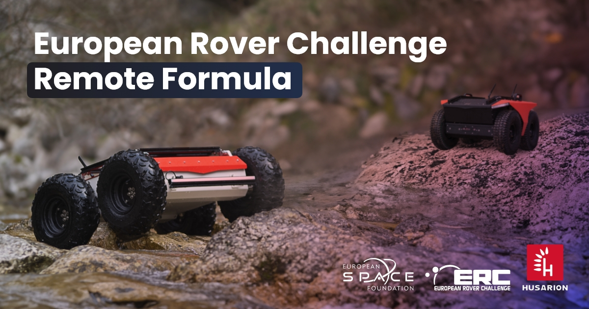

# European Rover Challenge 2025 - Remote Formula

This is a repository of information for **Remote Formula** (only) of the *European Rover Challenge 2025*.

- 🌍 [Official webpage](https://roverchallenge.eu)
- ✍️ [Registration](https://forms.gle/CShR9kNiHTriTsrs6)
- 📜 [Rulebook](RULES.md)
- 📖 [Technical Handbook](TECHNICAL_HANDBOOK.md)
- 🗣️ [Community Forum](https://erc2025.husarion.com)

## Results

| Place | Team name(s)                              | Total score |
| ----- | ----------------------------------------- | ----------- |
| 1     | Sapienza Technology Team                  | 427         |
| 2     | IITB Mars Rover Team                      | 409         |
| 3     | CRISS Robotics                            | 389         |
| 4     | SHUNYA                                    | 381         |
| 5     | TerraBots                                 | 285         |
| 6     | Mind Cloud                                | 206         |
| 7     | NSpace                                    | 161         |
| 8     | Team Interplanetar - BUET Mars Rover Team | 143         |
| 9     | DJS Antariksh                             | 136         |
| 10    | Team Robocon IITR                         | 118         |
| 11    | PSG Team Aurora                           | 77          |
| 12    | Makercie                                  | 56          |
| 13    | ARES, RIVAL                               | 54          |
| 14    | PUTLunarTeam                              | 51          |
| 15    | Amogh, Team Inferno DTU                   | 50          |
| 16    | ProjectRed                                | 45          |
| 17    | TeamHorizon                               | 38          |
| 18    | CSA ROBOTICS                              | 31          |
| 19    | BanglaBot Xplorer                         | 10          |
| 20    | ELTE StudentTechLab                       | 9           |
| 21    | BLAZERS                                   | 5           |
| 22    | light pheniox                             | 4           |
