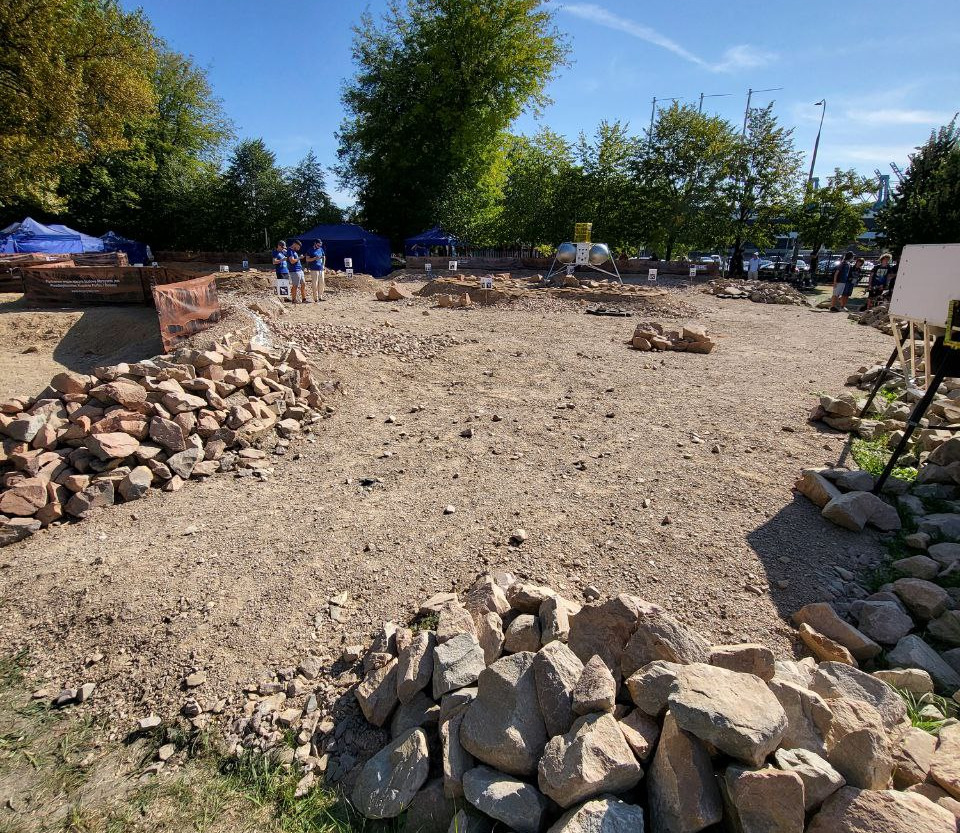
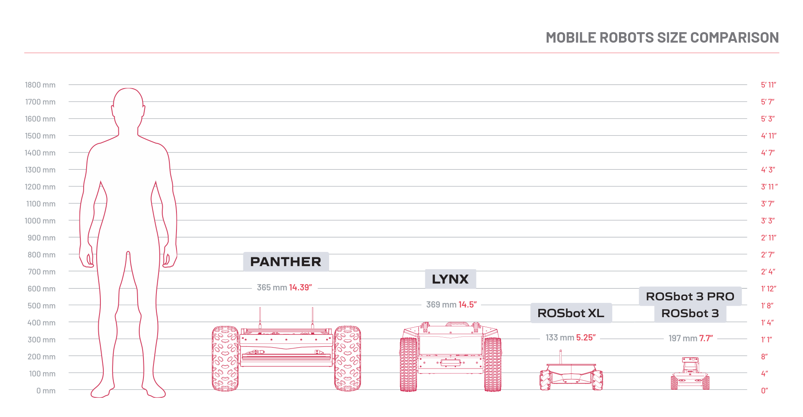
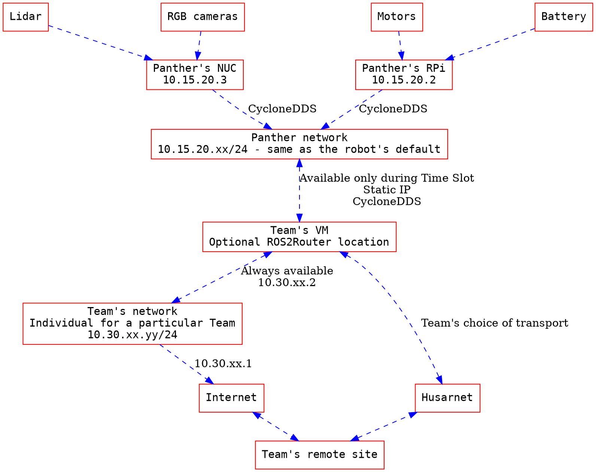
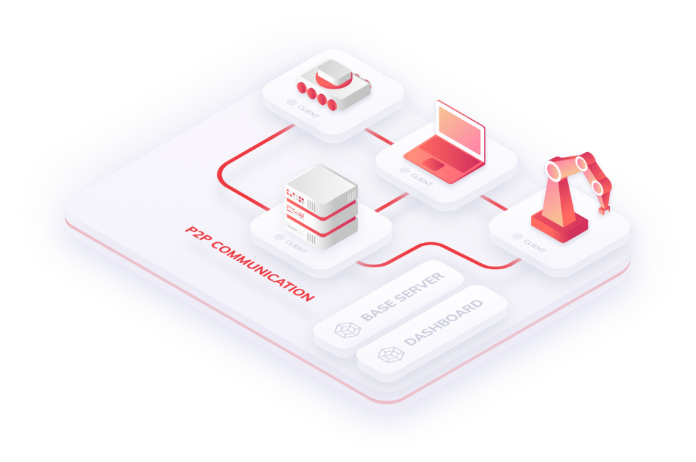
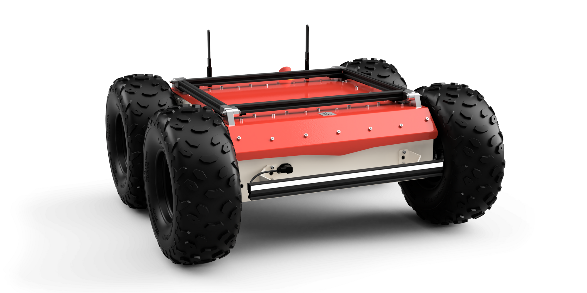
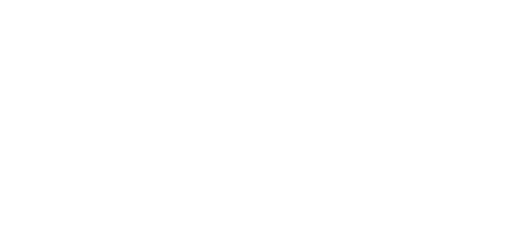
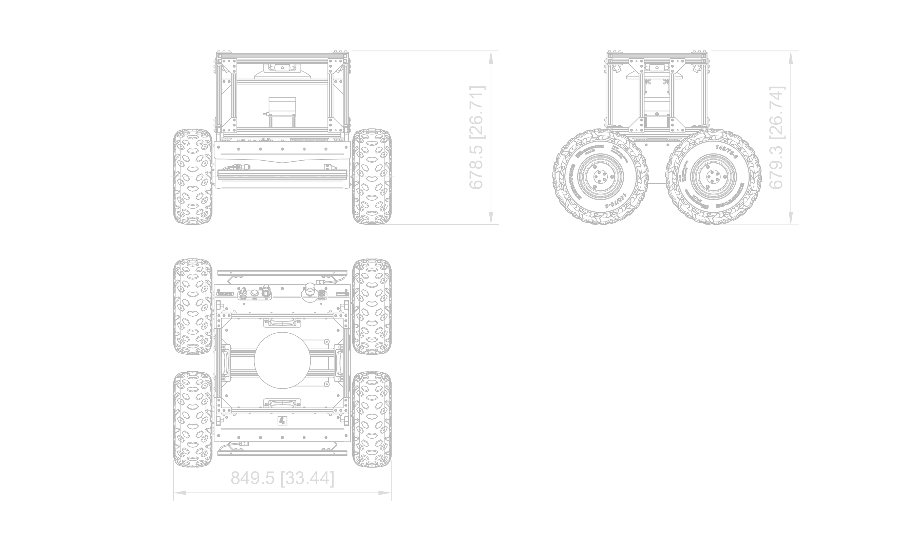
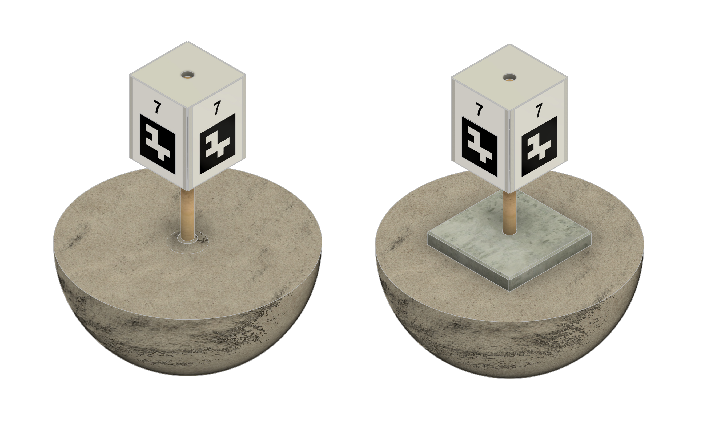
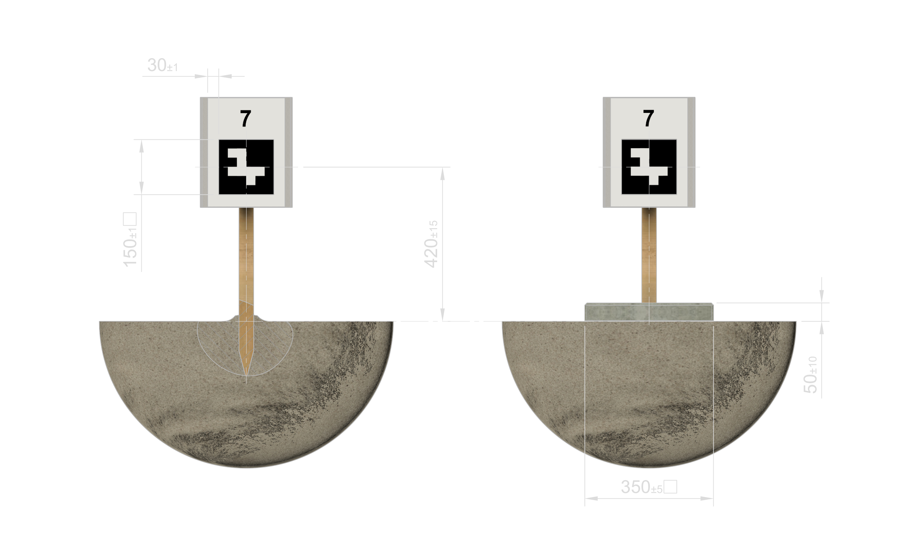

# European Rover Challenge 2025 - Remote formula - Technical Handbook

Intention od this document is to provide:
- details about the setup used for the Competition
- requirements for a successful participation in the Competition
- suggestions of the best practices for the Competition

## Wording

RFC 2119 keywords are used in this document. Whenever they are used, they are capitalized.

As a rule of thumb:
- the words MUST, MUST NOT and MAY (and their aliases) are to be considered extra rules that are not explicitly stated in the Rulebook - they are used to clarify the requirements here.
- the words SHOULD and SHOULD NOT (and their aliases) are suggestions about the best practices and proposed  solutions. They may or may not be a part of a scoring system, so it's best to address them somehow - either by implementing them or having an explanation why not. Keep in mind that these suggestions are usually not an exhaustive description of the required work.

Definitions and terms from the [Rulebook](RULES.md) apply to this document too.

If unspecified all dimensions are in millimeters (mm) and all angles in degrees (°). Dimensions in square brackets are optional and in inches (in).

## Marsyard

Marsyard - the area where the Competition takes place. It is a large, outdoor area with various obstacles on the ground and some infrastructure elements. For the Finals - it'll have the exact same configuration as the one used for the On-site formula. For the Competition Demo - it may be using it's configuration for this year or the one from last year On-site formula (or anything in between).

> [!NOTE]
> Keep in mind that all the photos and diagrams of the Marsyard used in this document are based on the last year's configuration and may not represent the actual configuration used during the Competition. We do not expect any groundbreaking changes, but some minor ones may happen. This is why Competitors SHOULD NOT rely on the exact configuration of the Marsyard.

Competitors MAY use any publicly available materials to get familiar with the Marsyard, including any files published for the on-site formula of the Competition.

> [!TIP]
> Simulation model for the Marsyard has not yet been made. We do encourage the Contestants to make their own models, i.e. based on the [last year's configuration](https://drive.google.com/drive/folders/1kvJ4vRcukgJdDpJXkft8xSptM3QwUmzl). Publishing a usable (this i.e. means decimated to a reasonable amount of polygons) model of the Marsyard on the Community Forum may be granted some extra points ;-)

## Robot setup

The Operator will be setting up robots for the Competition. The exact setup will vary depending on the particular robot's and Task's requirements. This year available platform will be [Husarion Panther](https://husarion.com/manuals/panther/overview/).

Panther's maximum speed will be limited to 1.0 m/s during the Competition. This is to ensure that the robot can safely operate in the Marsyard and that the Competitors can safely control it. We still advise Competitors to have a configurable maximum speed in their software, so that they can adjust it to the situation.

Competitors will NOT be given any more direct access to the robot's internals, including SSH access. Depending on the task, Robot's ROS 2 interface may be composed of nodes from two different machines - named User Computer and Built-in Computer in the respective robots' manuals. ROS nodes on the Robot are set up by the Competition Operator and not by the Teams.

Simulation models for the robot used during the Competition can be found [here](https://github.com/husarion/husarion_ugv_ros/tree/ros2-devel/husarion_ugv_description) and for some of their extra equipment [here](https://github.com/husarion/husarion_components_description). Competitors SHOULD use simulations to prepare for the Competition.

> [!WARNING]
> There may be a running [rosbag](http://wiki.ros.org/rosbag) setup in the infrastructure operated by the Judges. It's intention is to prevent any kind of cheating during the Competition. Competitors SHOULD be aware of such setup and MUST NOT try to circumvent it. Competitors MUST be aware that such logs (and any other kind of logs) may both be used by the Judges to score the Competition and be published (both during and after the Competition) for anyone to validate the results. If published, such logs/recordings MAY be used by the Competitors in the following years to prepare for the Competition.

<!-- TODO Add a note about the Judge's control override mechanism here -->

## Husarnet

[Husarnet](https://husarnet.com) - VPN network solution created and operated by Husarion (the Operator). It will be used to connect to the infrastructure during the whole competition.

All parts of infrastructure provided by the Operator will be using Operator's Husarnet account and counting towards that account's quota. These pieces of infrastructure will be tied together into Husarnet Groups and, during the Competition, Competitors will be invited to (and removed from) required Groups.

Some proficiency with Husarnet will be helpful during the Competition. Connectivity Test is the first part of the Competition testing these skills and Competitors MUST be able to connect to the provided infrastructure and SHOULD be able to complete basic tasks in Husarnet.

> [!WARNING]
> Competitors SHOULD test their Husarnet setup before the Competition. They MAY use any infrastructure that's available to them to do so. The especially tricky part may be any firewalls or NATs that are implemented in the Competitor's computers or on the network they are using. We do not encourage any insecure practices, and, in case of any issues, Competitors SHOULD use their best judgement and organization policies to resolve them.

Competitors MAY use any number of machines to provide their part of the infrastructure. In case the provided free account quota is exceeded - Competitors MUST contact the Operator to get more free quota assigned. Competitors MUST NOT pay for any Husarnet services for the purposes of the Competition. In case Competitors are using Husarnet for any other purposes, they SHOULD NOT use the same account for the Competition.

> [!TIP]
> Both the available Internet connection and Husarnet may limit the Competitor's ability to transmit large amounts of data via the Internet - i.e lidar/uncompressed camera data in full resolution, etc. Competitors MUST be aware of those limitations and SHOULD test and plan accordingly.

## On-site computing

There will be On-site computing infrastructure available to the Competitors during the Competition. The intention of this infrastructure is to provide a way of running any data-heavy workloads that may be required during the Competition.

There will be 5 physical machines, running a hypervisor with multiple virtual machines. Each Team will be assigned a single virtual machine with a fair share of the host's resources (CPU, RAM, disk and networking). This compute will be unavailable during the Connectivity Test, but it will be available during the ROS Test and onwards. Disk space will be limited to roughly 128GB per Team. CPU will be `Core i7 1360P` (expect a single P-core per Team and increase for the following events). We will start with 8GB of RAM per Team. Networking will be limited to 1Gbps, with a fair share of the host's resources. We do **not** expect any high-performance GPU access to be available during the Competition.

Contents of those Virtual Machines will be up to a Team to decide and will not be reset between the Tasks. Virtual Machines may be deleted by the Operator after not qualifying for the next Task.

Competitors MUST NOT rely on any specific tools being present and SHOULD be prepared to use their own tools.

> [!IMPORTANT]
> Competitors will not only have a Husarnet access to the machine and the rest of the infrastructure, but there will also be available a direct, IPv4 link between the On-site computing node and any nodes on the Robots themself. Intention here is to enable a reasonable way of running latency-sensitive workloads even if the networking solutions between the Robot and the Competitors are not advantageous.

Competitors MAY be using multiple machines on their side during the Competition.

## Team proposal

Team proposal does not have any technical requirements on top of the ones specified in the Rulebook.

## Test drives

### Connectivity Test

> [!NOTE]
> Connectivity Test will NOT be held on the Marsyard.
>
> During this Test robots may not be fully equipped with all the sensors and tools that will be available during the Competition Finals. Competitors MUST NOT rely on any specific sensors being present for this Test drive.

User manual for basic tasks in Husarnet can be found [here](https://husarnet.com/docs). Teams MAY be using any other materials to get familiar with the Husarnet.

Exact addresses to connect to/ping will be provided during the Test by the Judges.

WebUI will be a pre-made and pre-configured by the Operator [Foxglove](https://foxglove.dev/ros) interface. The exact address/URL will be provided during the Test by the Judges. Teams will be assigned any available robot at the Judges' discretion.

> [!TIP]
> This Test is meant to be a simple task of showing up, proving that you have the basics covered and that's it. Please do not take the preparation lightly though - we do **not** expect any second takes on different dates and so on. This is the reliability-testing part.

### ROS Test

ROS connectivity can happen via any ROS 2 compatible tool available to the Competitor - conforming to the mechanisms described in the [Robot setup](#Robot_setup) chapter above. Competitors SHOULD use any documentation available on [Husarion's website](https://husarion.com) and [Husarion's Github repository](https://github.com/husarion) to obtain the necessary information for such setup. Competitors MAY use any other applicable materials to get familiar with the Husarion's robots and ROS environment.

The exact ROS topics, whenever not already specified in the documentation, will be provided by the Judges during the Test. As those topics may depend on the robots used during the Test, Competitors SHOULD NOT rely on any specific topics being present and SHOULD be prepared to change used names in moment's notice.

### Payload Test

> [!NOTE]
> Payload Test will NOT be held on the Marsyard.
>
> Robots will be in configurations used in the Finals. ROS interface is intended to be the same as the one used during the Competition Finals, however Competitors are encouraged to provide feedback on the provided interfaces and if so MUST provide it as soon as possible to the Operator, as it may change the interface used in the following stages of the Competition.

There will be some Accessories (meaning items not attached to the robots but available in the environment) available for the Test, however they may not be the same as the ones used during the Competition Finals. Competitors SHOULD NOT rely on any specific Accessories being present for this Test drive. Detailed descriptions of the Final Accessories will be provided in later sections of this document.

> [!TIP]
> Guideline here would be to join the test with a short, clear plan as there won't be much time for figuring stuff out live. Payload test can result in some sort of a failure too (it's a test in the end) and scoring will be based on the completeness of the execution of the plan, not by the success like the Final Challenge.
>
> Recording of the data for further development can happen i.e. while doing any other parts of the Test drive - i.e. while presenting current developments to Judges, while doing a subsystem test, or even simply taking all the time left after other activities. Again - competitors MAY be using multiple machines and people for any of the tasks.
>
> TLDR - we want you to come with a clear plan proving that you're focused on the goal,  and leave with some useful data for the further development.

### Challenge Test

> [!NOTE]
> Challenge Test - may or may not be held on the Marsyard. Configuration of the Marsyard may or may not be the same as in Finals.
>
> Robots will be in configurations used in the Finals.
>
> Accessories will be the same as the ones used during the Competition Finals.

This whole Test may be streamed live or recorded and then published. Competitors MUST be aware of that and SHOULD prepare for such situation. Competitors MAY use such data for the further development. - goal of such recording is to give the Contestants as much data about the Final Challenge and scoring as possible.

> [!TIP]
> It's intended to mock the Finals as closely as possible and Competitors SHOULD treat it as such. Competitors MAY ask questions about the details of scoring but SHOULD NOT expect the full answers to those questions (as the exact scoring will be partially based on the performance of the other Competitors). Competitors MAY test different approaches to the tasks and ask Judges for feedback on those approaches.

## Final Challenge - Exploration Task

### Operation

Intention here is to create a setup where the robot autonomously navigates through the Marsyard and returns to the starting point after mapping the whole available area. Throughout the Marsyard there will be multiple Landmarks meant to be found and documented by the robot. Marsyard will be surrounded by a series of Markers that are meant to limit the area available for the autonomous operation.

> [!IMPORTANT]
> Competitors MAY choose to provide a less autonomous solution at any level, including full manual control. Manual control MAY be realized by implementing a custom ROS 2 interface or using the provided WebUI. WebUI is the least desired solution and will be scored accordingly.

WebUI will be disabled by default, and the Competitors wanting to use it  MUST ask the Judges to enable it.

Some parts of the Marsyard will be **unreachable to the robot** (especially autonomously) - because of the steep terrain. Unreachable areas inside the outer perimeter will **not** be guarded by the Markers. Competitors MUST be aware of such parts and any attempts of reaching such areas MUST be limited (i.e. by the number of attempts, time spent, etc.). Safety measures SHOULD be described to the Judges at the beginning of the Challenge and their states MUST be communicated live to the Judges during any risky manoeuvres. This includes both encouraging and discouraging the Judges from triggering any overrides based on the Team's confidence in any given situation.

> [!TIP]
> All Landmarks meant to be found will be visible from the ground level, so it'd make sense to i.e. incorporate other sensors available (like the built into the base platform IMU) and limit the allowed angles of the robot's movement based on the data from those sensors. This data can be later integrated to i.e. the cost-map used for the navigation - to prevent it from wasting time trying to climb hills.
>
> IMU may also be used for detecting things like - being stuck on rocks, etc. Such cases, when handled properly (i.e. by notifying the Contestants/Judges about the situation) MAY be scored positively in categories like Technical Excellence.

### The robot

<!---->

You'll also find 3D data of the robot in `models` directory of this repository.

> [!NOTE]
> Have in mind that the images above are showing only the base of the used robot. Additional equipment will be mounted on op of it during the Competition. Those pictures may later be updated to show the actual configurations used during the Competition.
<!-- TODO PIC Panther modded diagrams -->

Robot configuration available to the Competitors:

- [Husarion Panther](https://husarion.com/manuals/panther/overview/) - the base platform with extended battery
- 4xRGB camera (front, back, left, right) - Full HD, 30FPS, ROS driver controlled by the Operator, calibrated, publishing raw and compressed (MJPEG) images
- LSLIDAR C16 - ROS driver controlled by the Operator

On top of that some extra items will be added for other purposes:
- Some sort of safety-basket for sensors - the exact shape is undetermined at this point as we're aiming for one that does not obstruct the cameras' view while also minimizing the risk of damaging them upon collision
- [PAD02](https://husarion.com/manuals/panther/panther-options/#pad02---radiomaster-tx16s) - RadioMaster TX16S - to be used by Judges to manually control the robots in between Contestants and on their request. There will be some control override mechanism to suit that need and Competitors MUST adhere to any technical requirements it imposes. Exact control override mechanism will be provided later.

### Markers

Near the boundaries of the Marsyard there will be a series of Markers placed. The role of those Markers is two-fold - first to provide clear features for visual systems and also to provide a way of limiting the area available for the autonomous operation.

The number of markers will be between 10 and 50.

These Markers will have a high-contrast (black and white) digital tags on them (think QR/ArUco). Each of the tags will have a number as it's content. The tag right behind the robot in it's starting position will contain the highest available number. From the robot's perspective the numbers will be getting lower by 1 per tag in the clockwise direction - meaning that the tag behind the robot, on the right side will be `0`, and on the left, `n-1`. Contestants MAY or MAY NOT use this information in their algorithms.

The Markers won't be placed right at the physical boundary of the Marsyard, but rather some distance from it, on the inner side. The intention for that is to provide some lee-way for the robots, Contestants and the Judges when it comes to the safety behaviour. This way - the robots SHOULD NOT the virtual wall between any two Markers with consecutive numbers (soft-limit) but such position will still be within the area that they MUST NOT leave (hard-limit).

> [!NOTE]
> Some of the Markers will be placed in spots unreachable to the robots, especially operating autonomously. The algorithms provided by the Contestants MUST be aware of it and MUST NOT try to reach any fixed distance from the Markers.
>
> Markers will NOT be placed at the same height relative to the starting orientation of the robot - some of them will be placed on the hills surrounding the Marsyard. Competitors MUST take this into account when planning their algorithms.

Contestant MAY use the Markers in the maps created as a result of the Challenge. Contestants MAY present the Judges with any internally generated figures (like the geometric figure created by the Markers found during the Challenge) as a part of the Technical Excellence rating.

### Landmarks

Landmarks are the main items to be found during the Challenge. Landmarks will represent a couple of categories (like tools, infrastructure, items out of place, etc.) - Competitors MAY choose not to name the categories in their reports but SHOULD be aware that there will be Landmarks not typical to the Mars environment present during the Challenge, and they SHOULD note that in their reports in the descriptions of the respective items.

> [!IMPORTANT]
> Landmarks will be placed in the Marsyard in a way that they are visible to the robot operating from the ground level. Due to the viewing angles available the backgrounds will vary - from the Marsyard's surface to the sky. Competitors SHOULD plan for both cases (i.e. by using contours as an additional method of recognition).

Geological features MAY be included in the Landmarks by the Competitors however this is NOT the main goal for this Challenge. Landmarks added on top of the ones prepared for the On-site competition will be rather physical object oriented and NOT a soil or a rock.

> [!TIP]
> We will NOT be targeting only items from any popular object detection libraries. Some of them will certainly fit into such categories, but some of them will be less obvious and MAY require some additional processing to be recognized.
>
> The distinction we're aiming for is choose items vastly different from the ground and rocks already available on the Marsyard. We will be targeting the items that are on the large side (both in general and in terms of any given item), possibly with colors that are very distinct from the ground.
>
> Publishing a set of URDFs for proposed items on the Community Forum may get you some Community Excellence points ;-)

### Structure of the resulting data

Resulting file should be a PDF report that first outlines the general findings and then goes into details about each of the Landmarks found. For any data volume suggestions we're assuming page size of A4 and a font readable after printing on a regular household printer. Template for such report will NOT be provided, however the Contestants MAY use the Community Forum to validate their intermediate results.

The general findings section SHOULD include a map of the Marsyard with the path taken by the robot and the Landmarks (possibly Markers) found. In case of a map there MAY be some sort of a coordinate system specified. Any other data (like an LLM summary of the drive) MAY be included provided that it's value can be clearly understood by the reader. This section is expected to be at most a single page long.

Each of the Landmarks found SHOULD be presented on a separate **single** page. Descriptions of the Landmarks SHOULD contain:
- a photo of the Landmark
- a textual description of the Landmark
- the location of the Landmark (ideally with a map with a point on it and NOT a plain numerical GPS location)
- any other data that the Competitors find justified

Textual description of a Landmark SHOULD contain not only a vague description of an item but also a clear section of it's relation to the environment it was found in (i.e. whether the presence of such item on Mars is probable, whether it may be useful in the following steps of the mission, etc.).

> [!NOTE]
> Such reports do not need to be automatically sent to the Judges - that part of the Challenge is to be completely manual. The exact method of sending such reports will be provided during the Challenge (expect a Google Drive or an e-mail).

> [!TIP]
> We're only aiming for the structured PDF reports because of the ease of scoring. We will not be judging any intermediate steps of the data processing, as long as they are not affecting the final results. Competitors MAY use any tools available to them to create such reports, including any tools that are not ROS 2 based - i.e. one can simply add a "Take snapshot" button to the control panel, that will save all the camera images, locations, etc to a directory and then use any other data processing pipeline for analysis and creation of final report. TLDR - staring in the ROS world does not mean that you have to limit yourself to it.

## Competition Report

Competition Report does not have any technical requirements on top of the ones specified in the Rulebook.

## Social Excellence

Social Excellence does not have any technical requirements on top of the ones specified in the Rulebook.

## Jury points

Jury points do not have any technical requirements on top of the ones specified in the Rulebook.
